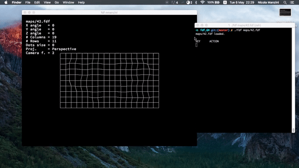

# 42-wire_frame_3D
A simplified 3D wireframe graphic representation of a relief landscape.

This program is made in C using the mlx library. it takes a height text map as input and displays it on a window.
It is possible to rotate the map with arrow keys and move it with (W,A,S,D). it is also possible to switch between parrarel and perspective projection.

